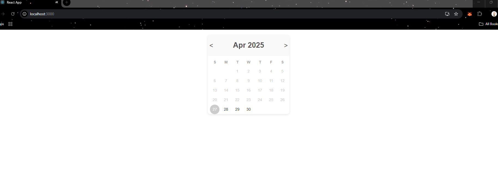
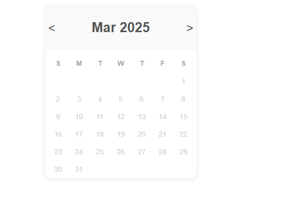
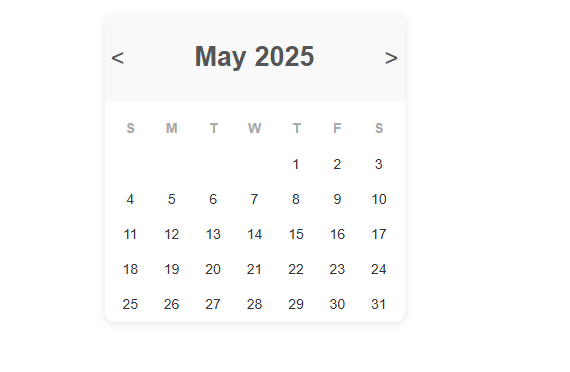
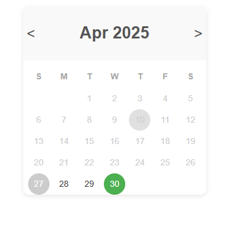
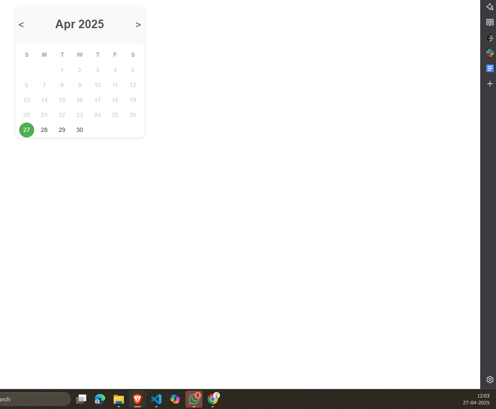

# Calendar App with ReactJS

This project was bootstrapped with [Create React App](https://github.com/facebook/create-react-app).

##  Installation

1. Clone the files , Just simply run the follwoing command in your terminal
### `git clone https://github.com/Hozipitol/calendar.git`

2. Run npm install, it automatically reads your package.json and installs dependencies.
### `npm install`

3. Runs the app in the development mode.
### `npm start`
Runs the app in the development mode.

# Code Details
### Imports & Constants
- **useState**, **useMemo** from React to manage state and memoize calculations  
- `MONTH_NAMES`, `WEEK_DAYS` arrays for headers  

### State Variables
- **currentDate** (`Date`): active month/year view  
- **selectedDate** (`Date | null`): user-chosen date  

### `today` Memo
- Creates a `Date` set to midnight for accurate day-only comparisons  

### `days` Memo (recomputes on `currentDate` or `selectedDate` change)
1. **Calculate `totalDays`**: `new Date(year, month + 1, 0).getDate()` gives days in month  
2. **Find `firstDay`**: `new Date(year, month, 1).getDay()` gives weekday index (0–6)  
3. **Initialize `daysArray`**: `Array(firstDay).fill(null)` adds blanks before day 1  
4. **Populate days**  
   - Loop from **1** to **totalDays**  
   - Create a `Date` object for each day  
   - Push an object with:  
     - `day` (`number`)  
     - `isToday` (`boolean`)  
     - `isPast` (`boolean`)  
     - `isSelected` (`boolean`)  

### Event Handlers
#### `changeMonth(offset)`
- Updates `currentDate` to the 1st of the new month  
- Resets `selectedDate` to `null`  

#### `handleDateClick(day)`
- Builds full `Date` for clicked day  
- Sets `selectedDate` only if the date is today or in the future  

## Working
1. **Display Current Month on Load**  
  Shows the current month and year (abbreviated month name) in the header.

2. **Highlight Today**  
  Marks today’s date in gray.

3. **Gray Out Past Dates**  
  Renders all dates before today in a muted/“disabled” style.

4. **Hide Out-of-Month Days**  
  Does not render any days that fall outside the currently displayed month.

5. **Month Navigation Arrows**  
  Provides `<` and `>` buttons to move to the previous or next month.
  

6. **Selectable Future Dates**  
  Allows clicking on today or any future date to select it (highlighted in green), and prevents selecting past dates.  
   

## For Testing
### `npm run test`
Launches the test runner and shows the output.

## `npm test -- --verbose`
Run this for detailed test cases description, with each test being passed you get message mentioned in describe block.

